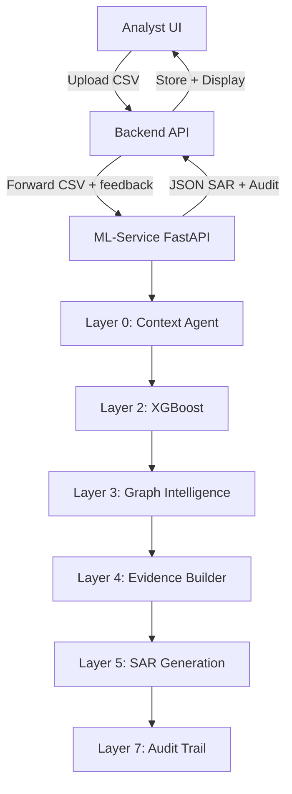
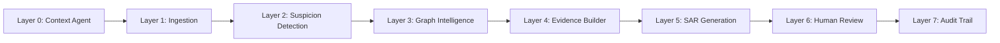
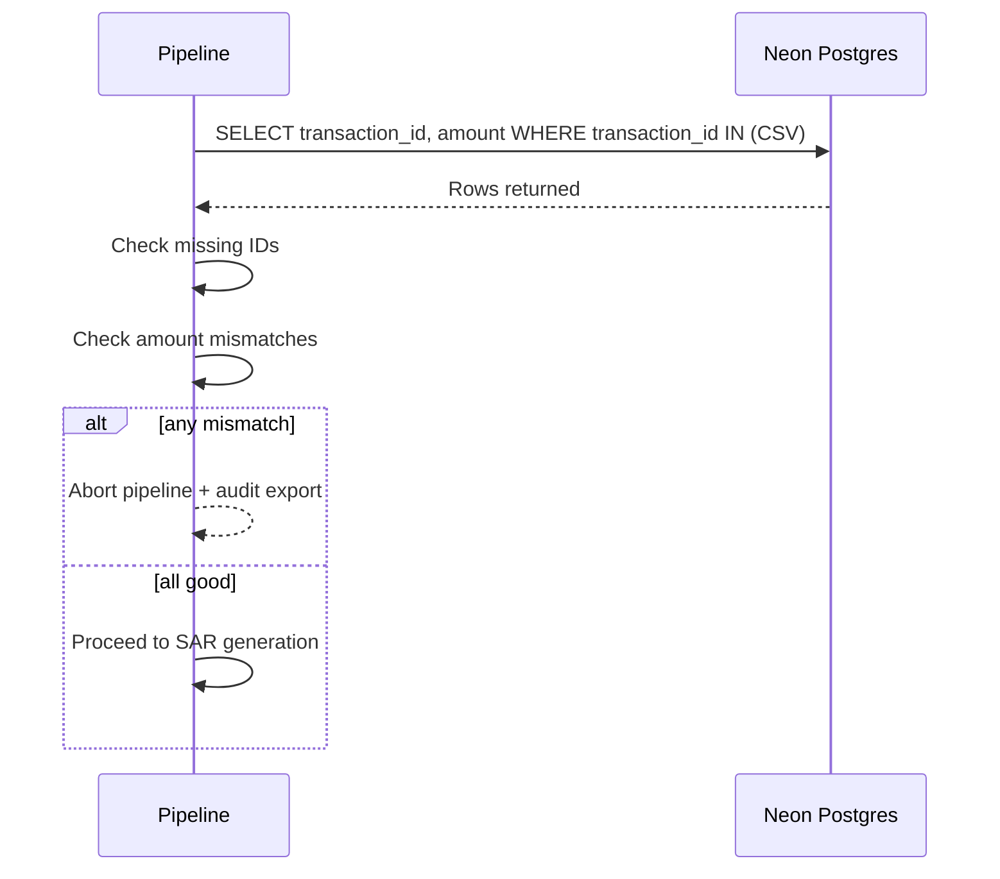
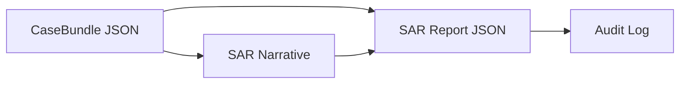
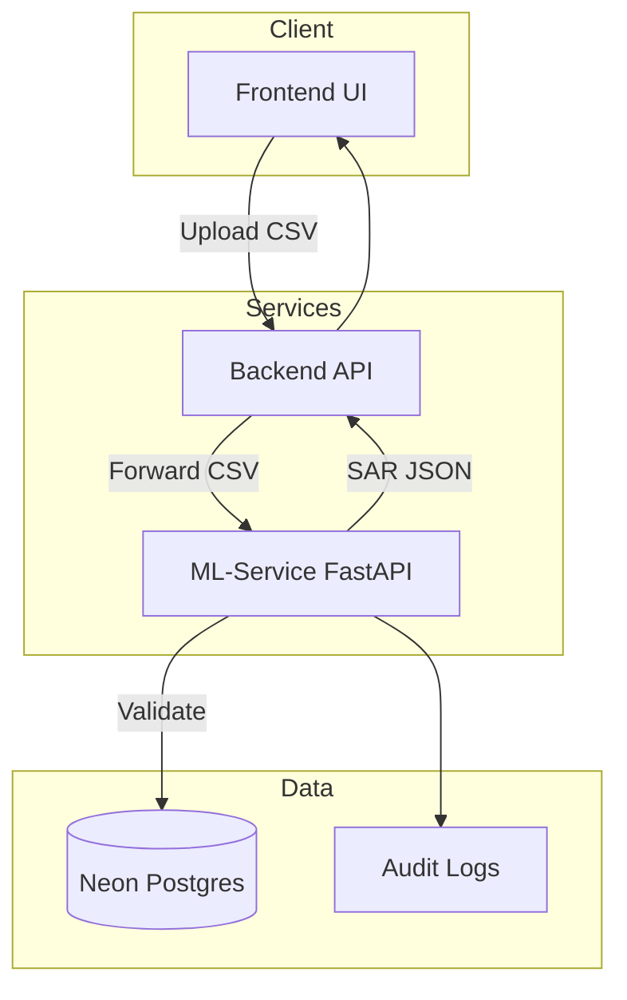
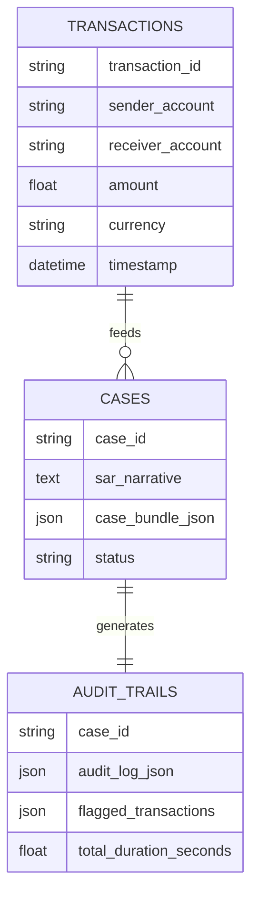

# SAR Generator Platform

An end-to-end Suspicious Activity Report (SAR) generation platform that pairs a 7-layer AML intelligence pipeline with a dedicated backend + frontend for investigation workflows. The primary goal is to produce explainable, regulator-ready SARs with full auditability.

## What This Repo Delivers

- **ML-Service**: 7-layer AML pipeline (context → ML → graph → evidence → LLM → audit)
- **Backend service**: API gateway for uploads, orchestration, and storage
- **Frontend service**: Analyst UI for SAR generation and review
- **Audit-first outputs**: L7 audit log + JSON SAR report

---

## System Overview



---

## 7-Layer AML Pipeline (High Level)



---

## Data Integrity Validation (Pre-SAR)

Two validation layers run **immediately before SAR generation**:

1) **DB Presence Check**: Ensures every transaction_id exists in the database.
2) **Amount Consistency Check**: Ensures `amount` matches DB values (tolerance $0.01).

If either fails, the pipeline **terminates** and writes an audit trail.



---

## Outputs

- `ML-Service/pipeline_outputs/L5_SAR_Report.json`: structured SAR report
- `ML-Service/pipeline_outputs/L7_audit_log_*.json`: audit trail
- `ML-Service/pipeline_outputs/L4_evidence_bundle.json`: evidence bundle



---

## Deployment Topology



---

## Data Model Snapshot



---

## Backend Service (Node.js)

### Purpose
- Accept uploads from UI
- Forward to ML-Service
- Return SAR JSON + audit

### Key Endpoint
- `POST /api/sar/generate` (multipart file upload)

### Config (backend/.env)
```
ML_SERVICE_URL=http://localhost:8000
PORT=5050
```

---

## Frontend Service (Analyst UI)

### Purpose
- Upload transaction CSV
- Show SAR JSON + summary
- View audit signals quickly

### Config (frontend/.env)
```
VITE_API_BASE=http://localhost:5050
```

---

## Local Dev (Quick Start)

1) **ML-Service**
```
cd ML-Service
uvicorn api:app --reload
```

2) **Backend**
```
cd backend
npm install
npm run dev
```

3) **Frontend**
```
cd frontend
npm install
npm run dev
```

---

## Deployment (Render)

Follow the steps in [RENDER_DEPLOYMENT.md](RENDER_DEPLOYMENT.md) to deploy the ML-Service. The backend and frontend can be deployed as separate services on Render or similar.

---

## Repo Structure

```
SAR-Generator/
  ML-Service/           # 7-layer pipeline + FastAPI
  backend/              # Node API gateway
  frontend/             # Analyst UI
  Dataset/              # Synthetic data
```
