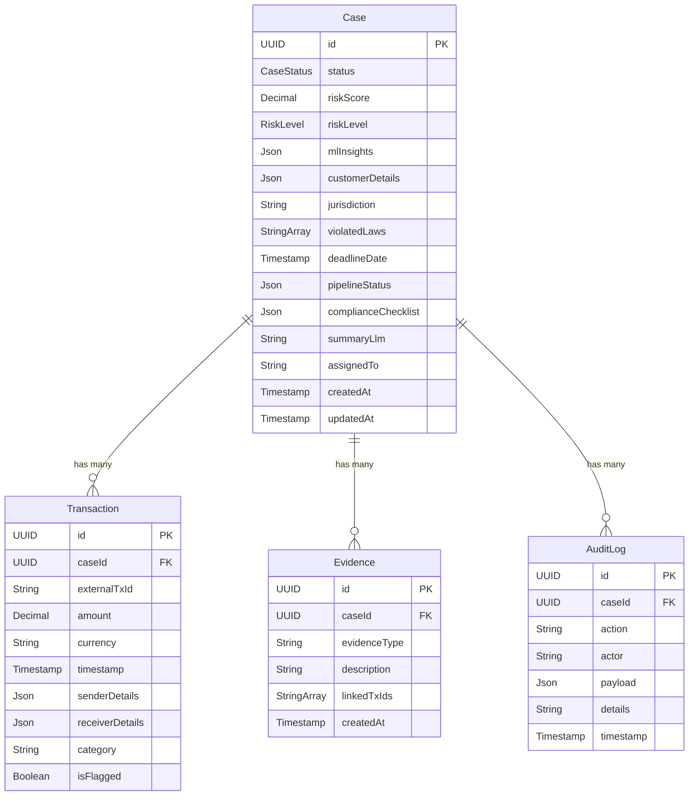

# 🛡️ Explainable SAR Narrative Generator

> An AI-powered backend system that ingests financial transaction data, runs ML-based risk analysis, extracts evidence, and generates **Suspicious Activity Report (SAR)** narratives with full explainability and audit trails.

---

## 📌 Project Status

| Module | Status | Notes |
|---|---|---|
| **Data Ingestion** (Layer 1–2) | ✅ Implemented & Routed | CSV/JSON transaction ingestion with validation, normalization & regulatory metadata |
| **Case Management** | ✅ Implemented & Routed | Full CRUD — list, get by ID, delete + compliance checklist updates |
| **Risk Analysis** (Layer 3–4) | ✅ Implemented & Routed (Mock) | Simulated ML pipeline with mock risk scores, pattern detection & violated laws |
| **Evidence Linking** (Layer 5) | ✅ Implemented & Routed | Extracts graph & typology evidence from ML insights, validates active patterns, status → `DRAFT` |
| **Narrative Generation** (Layer 6) | ✅ Implemented & Routed (Mock) | Compliance-gated mock SAR generation, saves narrative & status → `IN_REVIEW` |
| **Audit Logging** (Layer 7) | ✅ Implemented & Routed | Full audit trail query — logs created during Ingestion, Analysis, Evidence, Narrative & Checklist flows |
| **Analysis Service** | 🔲 Not Started | Service file created, business logic pending |
| **Frontend** | 🔲 Not Started | Planned for a future phase |

---

## 🏗️ Architecture Overview

The system follows a **7-Layer Pipeline Architecture** for processing suspicious financial activities:

```
┌─────────────────────────────────────────────────────────┐
│                   SAR Generator Pipeline                │
├─────────┬──────────┬──────────┬──────────┬──────────────┤
│ Layer 1 │ Layer 2  │ Layer 3-4│ Layer 5  │  Layer 6     │
│ Ingest  │ Enrich   │ Analyze  │ Evidence │  Narrative   │
│ (CSV)   │ (KYC/AML)│ (ML/AI)  │ (Link)   │  (LLM)      │
├─────────┴──────────┴──────────┴──────────┴──────────────┤
│                   Layer 7: Audit Trail                  │
└─────────────────────────────────────────────────────────┘
```

### Pipeline Flow

```
Ingest → Analyze → Extract Evidence → [Analyst Approves Checklist] → Generate Narrative → IN_REVIEW
```

Each step is gated and audited:

1. **Ingest** — Creates case + transactions with regulatory metadata (status: `INGESTED`)
2. **Analyze** — Simulated ML scoring, flags patterns, sets violated laws (status: `FLAGGED`)
3. **Evidence** — Links graph/typology evidence to the case (status: `DRAFT`)
4. **Checklist** — Analyst verifies identity, transactions, and evidence (human gate)
5. **Narrative** — Blocked until `evidence_attached` is `true`, then generates SAR draft (status: `IN_REVIEW`)

---

## 🛠️ Tech Stack

| Technology | Purpose |
|---|---|
| **Node.js + Express 5** | Backend REST API |
| **Drizzle ORM** | Database schema, migrations, and type-safe queries |
| **Drizzle-Kit** | Schema migration tooling & SQL generation |
| **Neon (PostgreSQL)** | Serverless cloud-hosted PostgreSQL database |
| **@neondatabase/serverless** | Neon DB connection via WebSocket pooling |
| **dotenv** | Environment variable management |
| **cors** | Cross-Origin Resource Sharing middleware |
| **nodemon** | Hot-reload during development |
| **tsx** | TypeScript execution for schema files |

---

## 📂 Project Structure

```
SAR-GENERATOR/
├── backend/
│   ├── controllers/                  # Request handlers for each domain
│   │   ├── IngestionController.js         ✅ Validates, normalizes & ingests transactions
│   │   ├── AnalysisController.js          ✅ Triggers simulated ML analysis pipeline
│   │   ├── caseController.js              ✅ CRUD + compliance checklist operations
│   │   ├── AuditController.js             ✅ Retrieves audit trail for a case
│   │   ├── EvidenceController.js          ✅ Extracts graph & typology evidence
│   │   └── NarrativeController.js         ✅ Compliance-gated mock SAR narrative generation
│   │
│   ├── routes/
│   │   ├── caseRoutes.js                  # Case CRUD, analysis, evidence, narrative & audit routes
│   │   └── ingestionRoutes.js             # Data ingestion endpoint
│   │
│   ├── services/
│   │   └── analysisService.js             🔲 Empty — pending business logic
│   │
│   ├── middlewares/
│   │   └── dbconfig.js                    # Drizzle + Neon DB config & client export
│   │
│   ├── src/
│   │   └── db/
│   │       └── schemas.ts                 # Drizzle schema (4 tables, 2 enums, full relations)
│   │
│   ├── drizzle/
│   │   ├── 0000_stormy_mandroid.sql       # Initial migration SQL
│   │   └── meta/                          # Drizzle migration metadata
│   │
│   ├── generated/                         # Auto-generated files (gitignored)
│   ├── utils/                             # Utility helpers (empty)
│   ├── index.js                           # Express app entry point
│   ├── drizzle.config.ts                  # Drizzle-Kit CLI configuration
│   ├── package.json                       # Dependencies & scripts
│   └── .env                               # Environment variables (DATABASE_URL)
│
├── .gitignore
└── README.md
```

---

## 📊 Database Schema

The database is powered by **PostgreSQL (Neon)** and managed through **Drizzle ORM**. Below is a summary of all tables, enums, and relations defined in `src/db/schemas.ts`.

### Entity Relationship Diagram



### Tables

#### `cases`
The central entity representing a suspicious activity investigation.

| Column | Type | Default | Description |
|---|---|---|---|
| `id` | `UUID` | `gen_random_uuid()` | Primary key |
| `status` | `case_status` enum | `INGESTED` | Current pipeline stage |
| `risk_score` | `Decimal(3,2)` | `null` | ML-computed risk score (e.g., `0.94`) |
| `risk_level` | `risk_level` enum | `LOW` | Categorical risk classification |
| `ml_insights` | `JSONB` | `null` | Smurfing/funneling patterns, SHAP values, graph data |
| `customer_details` | `JSONB` | `null` | Customer metadata for rapid development |
| `jurisdiction` | `Text` | `null` | Regulatory jurisdiction (e.g., `"FIU-IND (India)"`) |
| `violated_laws` | `Text[]` | `null` | Array of violated law references (e.g., `"PMLA Section 3"`) |
| `deadline_date` | `Timestamp` | `null` | 30-day regulatory filing deadline |
| `pipeline_status` | `JSONB` | `{ ingestion, enrichment, ml_analysis, narrative_gen }` | Pipeline progress tracker for UI |
| `compliance_checklist` | `JSONB` | `{ identity_verified, linked_tx_verified, ... }` | Analyst review checklist |
| `summary_llm` | `Text` | `null` | AI-generated SAR narrative |
| `assigned_to` | `Text` | `null` | Analyst user ID |
| `created_at` | `Timestamp` | `now()` | Record creation timestamp |
| `updated_at` | `Timestamp` | `now()` | Last modification timestamp |

**Relationships:** Has many `transactions`, `evidence`, `auditLogs`

---

#### `transactions`
Individual financial transactions linked to a case.

| Column | Type | Default | Description |
|---|---|---|---|
| `id` | `UUID` | `gen_random_uuid()` | Primary key |
| `case_id` | `UUID` | — | Foreign key → `cases.id` (cascade delete) |
| `external_tx_id` | `Text` | `null` | Original ID from bank CSV/API |
| `amount` | `Decimal(15,2)` | — | Transaction amount |
| `currency` | `Text` | `"INR"` | Currency code |
| `timestamp` | `Timestamp` | — | When the transaction occurred |
| `sender_details` | `JSONB` | — | `{ acc_id, name, country }` |
| `receiver_details` | `JSONB` | — | `{ acc_id, name, country }` |
| `category` | `Text` | `null` | e.g., "Wire Transfer", "ATM Withdrawal" |
| `is_flagged` | `Boolean` | `false` | Whether the transaction is flagged as suspicious |

---

#### `evidence`
Detected patterns and evidence items linked to a case.

| Column | Type | Default | Description |
|---|---|---|---|
| `id` | `UUID` | `gen_random_uuid()` | Primary key |
| `case_id` | `UUID` | — | Foreign key → `cases.id` (cascade delete) |
| `evidence_type` | `Text` | — | e.g., `"NETWORK_CHAIN"`, `"STRUCTURING_SMURFING"`, `"VELOCITY_SPIKE"` |
| `description` | `Text` | — | e.g., "Detected suspicious flow across 3 connected entity nodes." |
| `linked_tx_ids` | `Text[]` | — | Array of Transaction IDs that prove this evidence |
| `created_at` | `Timestamp` | `now()` | Record creation timestamp |

---

#### `audit_logs`
Immutable log of all system and analyst actions.

| Column | Type | Default | Description |
|---|---|---|---|
| `id` | `UUID` | `gen_random_uuid()` | Primary key |
| `case_id` | `UUID` | — | Foreign key → `cases.id` |
| `action` | `Text` | — | e.g., `"CASE_INGESTED"`, `"ML_ANALYSIS_COMPLETED"`, `"EVIDENCE_GENERATED"`, `"NARRATIVE_GENERATED"` |
| `actor` | `Text` | — | `"SYSTEM"`, `"LLM_LLAMA_3_1"`, or analyst name |
| `payload` | `JSONB` | `null` | Snapshot of what changed |
| `details` | `Text` | `null` | Human-readable description of the action |
| `timestamp` | `Timestamp` | `now()` | When the action occurred |

---

### Enums

#### `case_status`
Tracks the pipeline lifecycle of a case.

| Value | Description |
|---|---|
| `INGESTED` | Raw data has been received and stored |
| `ANALYZING` | ML models are processing the data |
| `FLAGGED` | ML analysis flagged the case as suspicious |
| `DRAFT` | Evidence extracted, awaiting analyst review |
| `IN_REVIEW` | SAR narrative generated, analyst is reviewing |
| `APPROVED` | Case has been approved for filing |
| `FILED` | SAR has been filed with the regulatory body |
| `FAILED` | An error occurred during processing |

#### `risk_level`
Categorical risk classification for a case.

| Value |
|---|
| `LOW` |
| `MEDIUM` |
| `HIGH` |
| `CRITICAL` |

---

## 🚀 Getting Started

### Prerequisites

- **Node.js** v18+
- **npm** v9+
- A **Neon** PostgreSQL database (or any PostgreSQL instance)

### Installation

```bash
# 1. Clone the repository
git clone https://github.com/Rishikesh831/SAR-GENERATOR.git
cd SAR-GENERATOR/backend

# 2. Install dependencies
npm install

# 3. Set up environment variables
#    Create a .env file in /backend with:
#    DATABASE_URL="postgresql://<user>:<password>@<host>/<database>?sslmode=require"

# 4. Run Drizzle migrations
npx drizzle-kit push

# 5. Start the development server
npm run start
```

The server will be running at `http://localhost:3000`.

### Verify It Works

```bash
# Health check
curl http://localhost:3000/health
# → { "status": "OK" }

# Root endpoint
curl http://localhost:3000/
# → "SAR Generator API is live!"
```

---

## 📡 API Endpoints

### Base Endpoints

| Method | Endpoint | Handler | Description |
|---|---|---|---|
| `GET` | `/` | `index.js` | Server status message |
| `GET` | `/health` | `index.js` | Health check |

### Layer 1: Ingestion (`/api/ingest`)

| Method | Endpoint | Controller | Description |
|---|---|---|---|
| `POST` | `/api/ingest` | `IngestionController.ingestData` | Validates, normalizes transactions & creates a new case with regulatory metadata |

### Case Management & Analysis (`/api/cases`)

| Method | Endpoint | Controller | Description |
|---|---|---|---|
| `GET` | `/api/cases` | `caseController.getAllCases` | Retrieve all cases (with transactions) |
| `GET` | `/api/cases/:id` | `caseController.getcasebyid` | Find a case by ID (with transactions) |
| `DELETE` | `/api/cases/:id` | `caseController.deletecase` | Delete a case by ID |
| `POST` | `/api/cases/:id/analyze` | `AnalysisController.analyzeCase` | Trigger simulated ML analysis pipeline |
| `GET` | `/api/cases/:id/audit` | `AuditController.getAuditTrail` | Retrieve audit trail for a case (sorted by latest) |
| `PATCH` | `/api/cases/:id/checklist` | `caseController.updateChecklist` | Update the compliance checklist for a case |
| `POST` | `/api/cases/:id/evidence` | `EvidenceController.extractEvidence` | Extract & link graph/typology evidence from ML insights |
| `POST` | `/api/cases/:id/generate-narrative` | `NarrativeController.generateNarrative` | Generate SAR narrative (compliance-gated, requires `evidence_attached: true`) |

---

## 🔄 Full Pipeline Walkthrough

Here's the complete end-to-end flow using the API:

```bash
# Step 1: Ingest transaction data → Creates a new Case (INGESTED)
POST /api/ingest
Body: { "transactions": [...], "customerMetadata": {...} }

# Step 2: Trigger ML Analysis → Scores risk, detects patterns (FLAGGED)
POST /api/cases/:id/analyze

# Step 3: Extract Evidence → Links graph & typology evidence (DRAFT)
POST /api/cases/:id/evidence

# Step 4: Analyst approves checklist (Human-in-the-loop gate)
PATCH /api/cases/:id/checklist
Body: { "checklist": { "identity_verified": true, "evidence_attached": true, ... } }

# Step 5: Generate SAR Narrative → Mock LLM output (IN_REVIEW)
POST /api/cases/:id/generate-narrative

# Audit: View full audit trail at any point
GET /api/cases/:id/audit
```

---

## 🗺️ Roadmap

- [x] Set up Drizzle ORM with Neon PostgreSQL
- [x] Define database schema with enums and relations
- [x] Implement data ingestion with regulatory metadata
- [x] Implement case CRUD operations
- [x] Implement mock ML analysis pipeline
- [x] Wire all existing controllers to Express routes
- [x] Implement audit trail query endpoint
- [x] Add compliance checklist update endpoint
- [x] Implement Evidence extraction & linking logic
- [x] Implement mock SAR Narrative generation with compliance gate
- [ ] Integrate real LLM (e.g., Llama 3.1 / Gemini / OpenAI) for narrative generation
- [ ] Build the Analysis Service with real ML model calls
- [ ] Add authentication & authorization middleware
- [ ] Build the frontend dashboard
- [ ] Add WebSocket support for real-time case status updates
- [ ] Deploy backend (Render) and frontend (Vercel)

---

## 👥 Team

This project is being built by a **3-person backend team** with the following areas of ownership:

| Member | Focus Area |
|---|---|
| **Member 1** | Data Ingestion, Normalization, and Case CRUD |
| **Member 2** | ML Analysis Pipeline, Evidence Linking, and Risk Scoring |
| **Member 3** | Narrative Generation (LLM), Audit Trails, and API Routing |

---

## 📄 License

ISC

---

<p align="center">
  <i>Built with ❤️ for making financial crime detection more transparent and explainable.</i>
</p>
