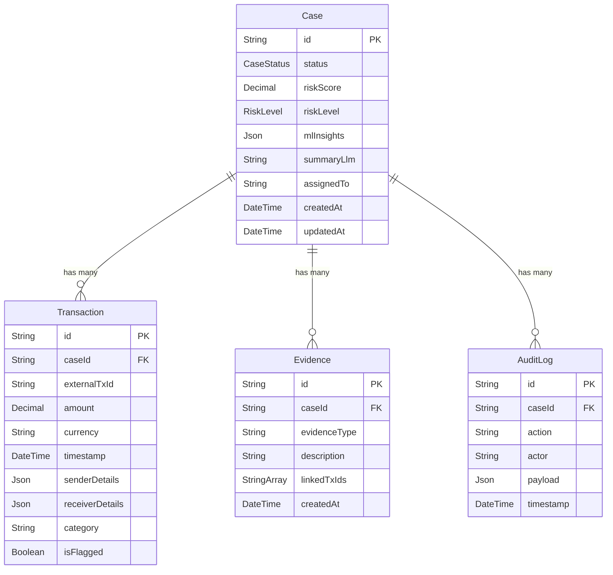

# 🛡️ Explainable SAR Narrative Generator

> An AI-powered backend system that ingests financial transaction data, runs ML-based risk analysis, and generates **Suspicious Activity Report (SAR)** narratives with full explainability and audit trails.

---

## 📌 Project Status

| Module | Status | Notes |
|---|---|---|
| **Data Ingestion** (Layer 1–2) | ✅ Implemented | CSV/JSON transaction ingestion with validation & normalization |
| **Case Management** | ✅ Implemented | Full CRUD — create, read, update, delete cases |
| **Risk Analysis** (Layer 3–4) | ✅ Implemented (Mock) | Simulated ML pipeline with mock risk scores & pattern detection |
| **Evidence Linking** (Layer 5) | 🔲 Not Started | Controller file created, logic pending |
| **Narrative Generation** (Layer 6) | 🔲 Not Started | Controller file created, LLM integration pending |
| **Audit Logging** (Layer 7) | 🟡 Partial | Audit log creation works within Ingestion & Analysis flows |
| **Analysis Service** | 🔲 Not Started | Service file created, business logic pending |
| **Frontend** | 🔲 Not Started | Planned for a future phase |

---

## 🏗️ Architecture Overview

The system follows a **7-Layer Pipeline Architecture** for processing suspicious financial activities:

```
┌─────────────────────────────────────────────────────────┐
│                   SAR Generator Pipeline                │
├─────────┬──────────┬──────────┬──────────┬──────────────┤
│ Layer 1 │ Layer 2  │ Layer 3-4│ Layer 5  │  Layer 6     │
│ Ingest  │ Enrich   │ Analyze  │ Evidence │  Narrative   │
│ (CSV)   │ (KYC/AML)│ (ML/AI)  │ (Link)   │  (LLM)      │
├─────────┴──────────┴──────────┴──────────┴──────────────┤
│                   Layer 7: Audit Trail                  │
└─────────────────────────────────────────────────────────┘
```

---

## 🛠️ Tech Stack

| Technology | Purpose |
|---|---|
| **Node.js + Express 5** | Backend REST API |
| **Prisma ORM (v7)** | Database schema, migrations, and queries |
| **Neon (PostgreSQL)** | Serverless cloud-hosted PostgreSQL database |
| **@prisma/adapter-neon** | Prisma ↔ Neon DB connection adapter |
| **nodemon** | Hot-reload during development |

---

## 📂 Project Structure

```
SAR-GENERATOR/
├── backend/
│   ├── controllers/           # Request handlers for each domain
│   │   ├── IngestionController.js    ✅ Validates & ingests transactions
│   │   ├── AnalysisController.js     ✅ Triggers ML analysis pipeline
│   │   ├── caseController.js         ✅ CRUD operations for cases
│   │   ├── AuditController.js        🟡 Stub — audit helper
│   │   ├── EvidenceController.js     🔲 Empty — pending implementation
│   │   └── NarrativeController.js    🔲 Empty — pending implementation
│   │
│   ├── routes/
│   │   └── caseRoutes.js             # Express route definitions
│   │
│   ├── services/
│   │   └── analysisService.js        🔲 Empty — pending business logic
│   │
│   ├── middleware/
│   │   └── dbconfig.js               # Prisma + Neon DB config & client export
│   │
│   ├── prisma/
│   │   ├── schema.prisma             # Database schema (4 models, 2 enums)
│   │   └── migrations/               # SQL migration history
│   │
│   ├── generated/prisma/             # Auto-generated Prisma Client (gitignored)
│   ├── utils/                        # Utility helpers (empty)
│   ├── index.js                      # Express app entry point
│   ├── prisma.config.ts              # Prisma CLI configuration
│   ├── package.json                  # Dependencies & scripts
│   └── .env                          # Environment variables (DATABASE_URL)
│
└── .gitignore
```

---

## 📊 Database Schema

The database is powered by **PostgreSQL (Neon)** and managed through **Prisma ORM**. Below is a summary of all models and enums.

### Entity Relationship Diagram



### Models

#### `Case`
The central entity representing a suspicious activity investigation.

| Field | Type | Default | Description |
|---|---|---|---|
| `id` | `String` (UUID) | Auto-generated | Primary key |
| `status` | `CaseStatus` | `INGESTED` | Current pipeline stage |
| `riskScore` | `Decimal(3,2)` | `null` | ML-computed risk score (e.g., `0.94`) |
| `riskLevel` | `RiskLevel` | `LOW` | Categorical risk classification |
| `mlInsights` | `Json` | `null` | Smurfing/funneling patterns, SHAP values, graph data |
| `summaryLlm` | `Text` | `null` | AI-generated SAR narrative |
| `assignedTo` | `String` | `null` | Analyst user ID |
| `createdAt` | `DateTime` | `now()` | Record creation timestamp |
| `updatedAt` | `DateTime` | Auto | Last modification timestamp |

**Relationships:** Has many `Transaction[]`, `Evidence[]`, `AuditLog[]`

---

#### `Transaction`
Individual financial transactions linked to a case.

| Field | Type | Default | Description |
|---|---|---|---|
| `id` | `String` (UUID) | Auto-generated | Primary key |
| `caseId` | `String` | — | Foreign key → `Case.id` (cascade delete) |
| `externalTxId` | `String` | `null` | Original ID from bank CSV/API |
| `amount` | `Decimal(15,2)` | — | Transaction amount |
| `currency` | `String` | `"INR"` | Currency code |
| `timestamp` | `DateTime` | — | When the transaction occurred |
| `senderDetails` | `Json` | — | `{ acc_id, name, country }` |
| `receiverDetails` | `Json` | — | `{ acc_id, name, country }` |
| `category` | `String` | `null` | e.g., "Wire Transfer", "ATM Withdrawal" |
| `isFlagged` | `Boolean` | `false` | Whether the transaction is flagged as suspicious |

---

#### `Evidence`
Detected patterns and evidence items linked to a case.

| Field | Type | Default | Description |
|---|---|---|---|
| `id` | `String` (UUID) | Auto-generated | Primary key |
| `caseId` | `String` | — | Foreign key → `Case.id` (cascade delete) |
| `evidenceType` | `String` | — | e.g., `"SMURFING_PATTERN"`, `"VELOCITY_SPIKE"` |
| `description` | `String` | — | e.g., "108 small transactions in 24 hours" |
| `linkedTxIds` | `String[]` | — | Array of Transaction IDs that prove this evidence |
| `createdAt` | `DateTime` | `now()` | Record creation timestamp |

---

#### `AuditLog`
Immutable log of all system and analyst actions.

| Field | Type | Default | Description |
|---|---|---|---|
| `id` | `String` (UUID) | Auto-generated | Primary key |
| `caseId` | `String` | — | Foreign key → `Case.id` |
| `action` | `String` | — | e.g., `"STATUS_CHANGE"`, `"ML_ANALYSIS_COMPLETED"` |
| `actor` | `String` | — | `"SYSTEM"` or analyst name |
| `payload` | `Json` | `null` | Snapshot of what changed |
| `timestamp` | `DateTime` | `now()` | When the action occurred |

---

### Enums

#### `CaseStatus`
Tracks the pipeline lifecycle of a case.

| Value | Description |
|---|---|
| `INGESTED` | Raw data has been received and stored |
| `ENRICHING` | Data is being enriched with external sources |
| `ANALYZING` | ML models are processing the data |
| `GENERATING_NARRATIVE` | LLM is writing the SAR narrative |
| `COMPLETED` | Full pipeline has finished |
| `FAILED` | An error occurred during processing |

#### `RiskLevel`
Categorical risk classification for a case.

| Value |
|---|
| `LOW` |
| `MEDIUM` |
| `HIGH` |
| `CRITICAL` |

---

## 🚀 Getting Started

### Prerequisites

- **Node.js** v18+
- **npm** v9+
- A **Neon** PostgreSQL database (or any PostgreSQL instance)

### Installation

```bash
# 1. Clone the repository
git clone https://github.com/Rishikesh831/SAR-GENERATOR.git
cd SAR-GENERATOR/backend

# 2. Install dependencies
npm install

# 3. Set up environment variables
#    Create a .env file in /backend with:
#    DATABASE_URL="postgresql://<user>:<password>@<host>/<database>?sslmode=require"

# 4. Run Prisma migrations
npx prisma migrate dev

# 5. Generate the Prisma client
npx prisma generate

# 6. Start the development server
npm run start
```

The server will be running at `http://localhost:3000`.

### Verify It Works

```bash
# Health check
curl http://localhost:3000/health
# → { "status": "OK" }

# Root endpoint
curl http://localhost:3000/
# → "Server is up and running!"
```

---

## 📡 API Endpoints

### Currently Active

| Method | Endpoint | Controller | Description |
|---|---|---|---|
| `GET` | `/` | `index.js` | Server status message |
| `GET` | `/health` | `index.js` | Health check |
| `GET` | `/api/cases` | `caseController.getAllCases` | Retrieve all cases |

### Implemented (Not Yet Routed)

These controllers exist but are **not yet wired** into `routes/`:

| Controller | Function | Description |
|---|---|---|
| `IngestionController` | `ingestData` | Validates, normalizes, and stores transactions as a new case |
| `AnalysisController` | `analyzeCase` | Triggers mock ML analysis, updates risk score & insights |
| `caseController` | `postcase` | Create a new case |
| `caseController` | `getcasebyid` | Find a case by ID with transactions |
| `caseController` | `analysecase` | Trigger analysis (status → PROCESSING) |
| `caseController` | `deletecase` | Delete a case by ID |

### Planned (Not Yet Implemented)

| Controller | Purpose |
|---|---|
| `EvidenceController` | Link evidence items (patterns, anomalies) to cases |
| `NarrativeController` | Generate SAR narratives using LLM integration |
| `AuditController` | Query and manage the full audit trail |

---

## 🗺️ Roadmap

- [ ] Wire all existing controllers to Express routes
- [ ] Implement Evidence linking logic
- [ ] Integrate LLM (e.g., OpenAI / Gemini) for narrative generation
- [ ] Build the Analysis Service with real ML model calls
- [ ] Add authentication & authorization middleware
- [ ] Build the frontend dashboard
- [ ] Add WebSocket support for real-time case status updates
- [ ] Deploy backend (Render) and frontend (Vercel)

---

## 👥 Team

This project is being built by a **3-person backend team** with the following areas of ownership:

| Member | Focus Area |
|---|---|
| **Member 1** | Data Ingestion, Normalization, and Case CRUD |
| **Member 2** | ML Analysis Pipeline, Evidence Linking, and Risk Scoring |
| **Member 3** | Narrative Generation (LLM), Audit Trails, and API Routing |

---

## 📄 License

ISC

---

<p align="center">
  <i>Built with ❤️ for making financial crime detection more transparent and explainable.</i>
</p>
